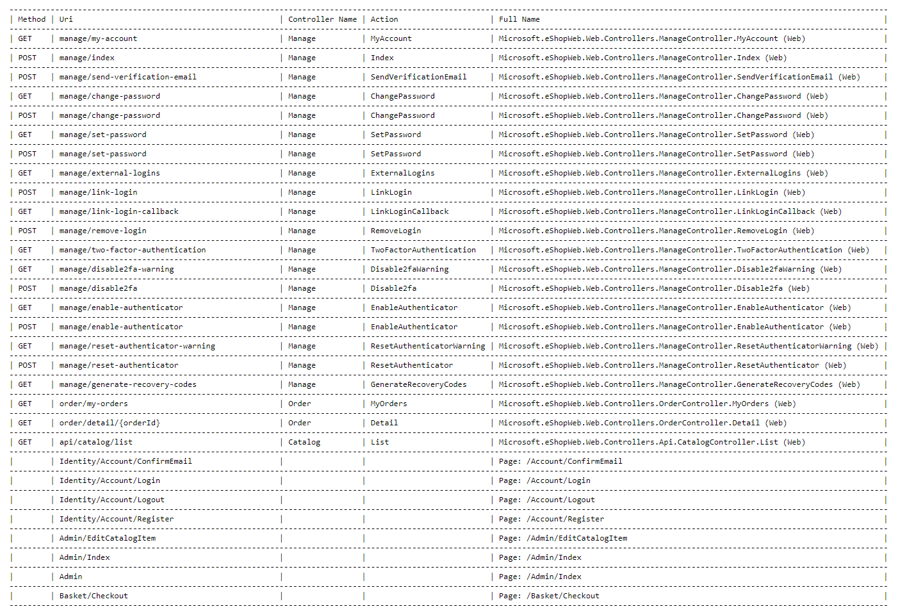

# RoutesList

Library can be used to show a list of all the registered routes for the application.

Library show all Routes in table format - methods, Uri, Controller Name, Action, Full name of path or namespace



## Installation

From nuget.org
```
Install-Package RoutesList 
```


## Usage 

Just add IActionDescriptorCollectionProvider to startup.cs to the "Configure" function.

Startup.cs 
```
\\...

http://yourapplicationaddress/routes

public void Configure(
	IApplicationBuilder app,
	IWebHostEnvironment env,
	IActionDescriptorCollectionProvider collectionProvider
)
{
	\\...
	app.UseEndpoints(endpoints =>
   {
		\\...
		endpoints.MapGet("/routes", async context =>
		{
			await context.Response.WriteAsync(RoutesList.RoutesList.AsyncGetRoutesList(collectionProvider).Result.ToString());
		});
	}); 
	
}
```

<hr>

If you use Microsoft.Extension.Logger, you can add output for logging at the debug level
```
logger.LogDebug(RoutesList.RoutesList.AsyncGetRoutesList(collectionProvider).Result.ToString());
```
