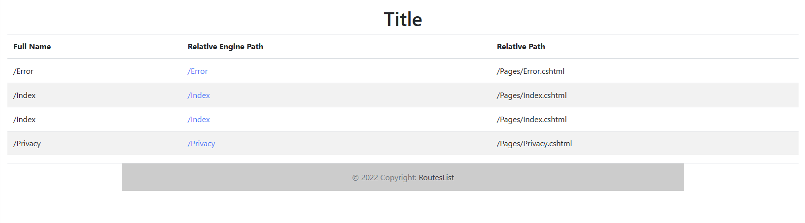

# RoutesList

Library can be used to show a list of all the registered routes for the application.

Library show all Routes in table format - methods, Uri, Controller Name, Action, Full name of path or namespace



## Installation

From nuget.org
```
Install-Package RoutesList 
```


## Usage 

```
\\ RoutesList with ILogger
RoutesList(IActionDescriptorCollectionProvider actionProvider, ILogger logger)

\\ RoutesList without ILogger
RoutesList(IActionDescriptorCollectionProvider actionProvider)
```

Just add IActionDescriptorCollectionProvider to startup.cs to the "Configure" function.

Startup.cs 
```
\\...

http://yourapplicationaddress/routes

public void Configure(
	IApplicationBuilder app,
	IWebHostEnvironment env,
	Microsoft.AspNetCore.Mvc.Infrastructure.IActionDescriptorCollectionProvider actionProvider
)
{
	\\...
	var routes = new RoutesList.RoutesList(actionProvider)
	app.UseEndpoints(endpoints =>
   {
		\\...
		endpoints.MapGet("/routes", async context =>
		{
			await context.Response.WriteAsync(routes.AsyncGetRoutesList().Result.ToString());
		});
	}); 
	
}
```
<hr>
If you use Microsoft.Extension.Logger, you can add output for logging at the debug level
```

var routes = new RoutesList.RoutesList(actionProvider, logger);
routes.GetLoggerRoutesList();
```